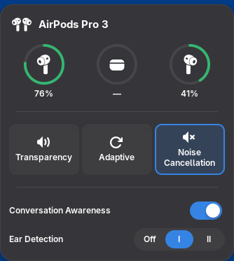

# AirPods for GNOME

AirPods battery levels and controls in the Fedora GNOME top bar. Includes a
GNOME Shell 50 extension, a Rust backend based on LibrePods, and the icon source.



Preview uses sample battery data. [Light theme](docs/preview-light.png).

## Controls

- Battery rings show left, case, and right. The indicator hides when disconnected.
- Click a listening mode, or right-click/scroll the top-bar icon to cycle modes.
- Use the slider for Adaptive noise level and the Conversation Awareness switch.
- **Ear Detection:** Off disables automatic pausing; I pauses when either AirPod
  is removed; II pauses when both are removed. Supports clicks, Space, and arrow keys.

Controls update immediately and recover if a command fails. Available controls
vary by model. AirPods Max shows one headphone battery.

See the [behavior overview](docs/behavior.md) for each action and event.

Ear Detection persists across backend restarts. Conversation Awareness and
Adaptive choices are remembered, but live AirPods reports take precedence.
Listening mode comes from the AirPods; reconnecting does not force a saved preset.
Settings live in `~/.config/AirPodsTrayApp/`; the earlier C++ configuration is
imported without removing it.

Unknown battery readings show a dash. Case readings can be stale; opening the lid
with an AirPod in the case may refresh them. Left and right readings come directly
from the daemon.

## Install

Use the full project source. On Fedora 44, install the build dependencies:

```bash
sudo dnf install cargo rust gcc python3 pipewire-utils wireplumber
```

Then run from the project directory:

```bash
./setup
```

Setup builds and tests the bundled daemon, installs both components under
`~/.local`, and enables or restarts `airpods-gnome.service`. Saved daemon settings
are preserved. Cargo downloads the dependencies pinned in `daemon/Cargo.lock`
on the first build. Set `CARGO_BUILD_JOBS` to adjust the default eight build jobs.
Bash and GNOME's `gnome-extensions` command must also be available.

Log out and back in, then enable it:

```bash
extension_uuid=$(python3 -c 'import json; print(json.load(open("metadata.json"))["uuid"])')
gnome-extensions enable "$extension_uuid"
```

Pair your AirPods in GNOME Bluetooth Settings. The indicator appears when they
connect. The extension lives in `~/.local/share/gnome-shell/extensions/`; daemon
commands `airpods-gnome` and `airpods-gnome-ctl` live in `~/.local/bin/`, and status is written to
`~/.local/state/librepods/status.json`.

Run `./setup` again to update both components, or `bash scripts/install.sh` for
extension-only changes. Extension code updates need a new GNOME session.

## Source

- `daemon/`: the Rust backend, with [upstream provenance](daemon/UPSTREAM.md).
- `assets/`: original QML icon source; `icons/` contains the generated SVGs and notices.
- `scripts/`: build, packaging, and icon tools. Generated output goes in `build/` and `dist/`.

## Development

Requires Node.js/npm, GJS, and Python 3. No npm dependencies are needed.

```bash
./setup --build-only
npm run check
npm test
npm run test:backend
npm run test:icons
npm run test:installer
npm run test:uninstaller
npm run test:lifecycle
npm run test:shell
npm run pack
npm run pack:source
```

`--build-only` builds and tests the daemon and packages the extension without
installing anything. Regenerate icons with `python3 scripts/import-omapods-icons.py`.

The lifecycle tests run the real daemon and control client with an isolated,
simulated AirPods transport. The Shell test needs `gnome-shell-test-tool`,
`dbus-run-session`, and graphics access; it runs an isolated GNOME session with
sample data and mocked commands. Check real battery readings and audio changes
with connected AirPods.

`dist/` contains the extension-only ZIP and, with `pack:source`, a source tarball
including the backend and setup script. Build and icon generation use bundled
source; normal Fedora dependencies are still required.

## Remove

Run from the project directory, without sudo:

```bash
./uninstall
```

This removes the extension, backend binaries, user service, startup link, and
migration compatibility symlink. Saved settings and the source project are kept.

## Credits and license

Extension code: [GPL-3.0-or-later](LICENSE). The bundled
[GPL-licensed daemon](daemon/LICENSE) derives from
[LibrePods](https://github.com/librepods-org/librepods) through
[Omapods](https://github.com/thisisgm/omarchy-pods).

Icons use Apple's product artwork from Omapods' `AirPodsIcon.qml`, converted to
SVG. They are excluded from the software license; see [icon credits](icons/README.md).
This project is independent of Apple.
